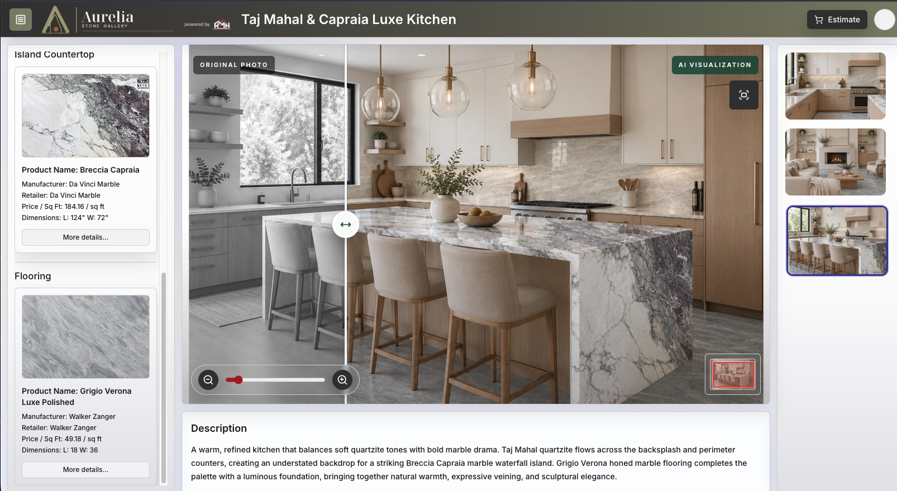

# Sandip Ghosh

**Founder, Remodel My Home | Engineering & product leader**

I'm a hands-on founder with a background in enterprise software, early-stage startups, and home-design technology. Today, I'm building [Remodel My Home](https://remodelmyhome.ai): connecting design, visualization, material discovery, measurement, pricing, and commerce for the remodeling and building-materials industry.

[Website](https://remodelmyhome.ai) · [Explore RMH](https://app.remodelmyhome.ai) · [LinkedIn](https://www.linkedin.com/in/sghosh-tech-lead/)

## RMH in action

**RMH co-branded retailer demo:** Before-and-after visualization connected to selected materials, product specifications, pricing, and multiple room views.

[Explore the retailer demo →](https://app.remodelmyhome.ai/o/aurelia-stone)

## What I'm building at RMH

### CV-grounded visualization

Combining deterministic computer vision with generative AI as a controlled photorealistic enhancement layer. Computer vision anchors room geometry, surface boundaries, perspective, scale, and selected-material placement; AI enhances the result within those constraints.

The focus is structural fidelity, material accuracy, and repeatability—not simply generating attractive room images.

### Multimodal material discovery

Building natural-language, speech, and image-based search across catalogs of real-world materials. The discovery layer connects product imagery with specifications, pricing, and metadata to help people find products that fit their design intent.

### Co-branded, project-based SaaS

Architecting a multi-tenant platform for retailers, designers, contractors, and homeowners to collaborate around shared project context: materials, designs, pricing, measurements, and deliverables. Retailer-branded experiences are part of a broader goal to connect homeowner projects with the businesses that supply and deliver them.

### Measurement and estimation

Developing AI-assisted room detection and area calculation from floorplan diagrams, along with surface-level material estimation, to connect visual design decisions with quantities and project planning.

## Research and roadmap

Exploring image-to-image model training and fine-tuning for remodel visualization, with an emphasis on structural fidelity and material consistency. LiDAR-based room capture is on the roadmap to bring real-world geometry and measurements into the same project workflow.

## Technical toolkit

Python · TypeScript · FastAPI · React · PostgreSQL · Qdrant · LangGraph · AWS

## Previously

- **Interior Logic Group — Director of Engineering.** Led development of Auros Home Design from inception, serving major U.S. homebuilders including Shea Homes, Woodside Homes, Taylor Morrison, D.R. Horton, Toll Brothers, and Tri Pointe. This work gave me firsthand experience with the design, visualization, material selection, and pricing workflows behind RMH.
- **Resilient Networks — Founding team member → VP of Engineering.** The company was acquired in 2020.
- **Earlier engineering roles:** Salesforce's core platform team, BEA Systems' WebLogic Integration team, PointCast, and SpikeSource.

## About my GitHub

Most of my current development is in private repositories for RMH. This profile shares the product and engineering context behind that work.
